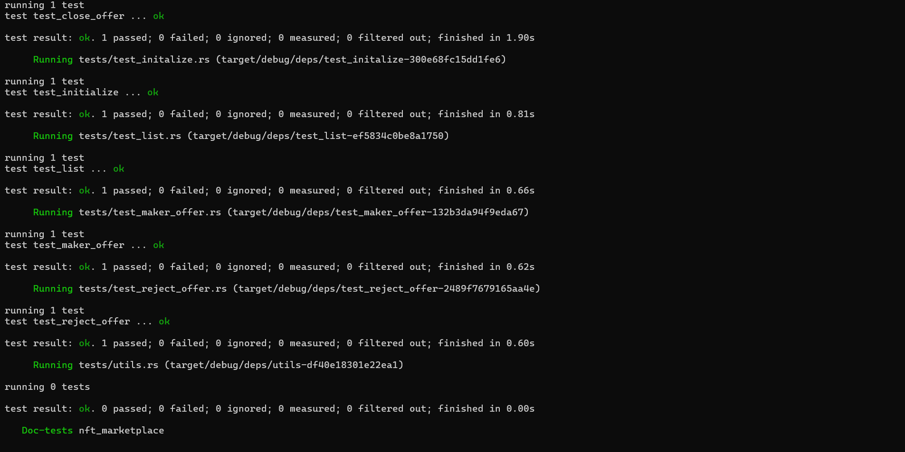

# NFT Marketplace (Anchor)



---

## Clone Repository

```bash
git clone https://github.com/Nikuunj/q2-nft-marketplace
cd q2-nft-marketplace
```

---

# Installation

## Windows

Install WSL first.

Recommended:

* WSL2
* Ubuntu 22+

---

## macOS / Linux

Install Solana:

```bash
curl --proto '=https' --tlsv1.2 -sSfL https://solana-install.solana.workers.dev | bash
```

Restart your terminal after installation.

---

## Installed Versions Example

```bash
Rust: rustc 1.85.0
Solana CLI: 3.1.10
Anchor CLI: 0.31.1
Node.js: v23+
Yarn: 1.22+
```

---

# Project Structure

```bash
.
├── programs/
│   └── nft-marketplace/
├── migrations/
├── Anchor.toml
└── README.md
```

---

# Build

Build the program:

```bash
anchor build
```

---

# Test

Run all tests:

```bash
anchor test
```

Run without rebuilding:

```bash
anchor test --skip-build
```

Run a single test:

```bash
anchor test -- --test test_buy
```

---

# Marketplace Architecture

The marketplace supports:

* NFT Listings
* NFT Purchases
* Offers / Bidding
* Offer Acceptance
* Offer Rejection
* Listing Cancellation
* Marketplace Fee Collection
* Reward Distribution

---

# Instructions

## 1. Initialize Marketplace

Creates the marketplace configuration account.

### Parameters

```rust
initialize(name, fee)
```

### Stores

```rust
pub struct MarketPlace {
    pub name: String,
    pub fee: u16,
}
```

### PDA

```rust
[b"marketplace", name.as_bytes()]
```

---

## 2. List NFT

Lists an NFT for sale.

### Flow

```text
User NFT
    ↓
Program Vault
    ↓
Listing Created
```

### Accounts Created

* Listing PDA
* NFT Vault

### PDA

```rust
[b"listing", asset]
```

---

## 3. Buy NFT

Allows a buyer to purchase a listed NFT.

### Flow

```text
Buyer SOL
      ↓
Seller Receives Payment
      ↓
Marketplace Receives Fee
      ↓
NFT Transferred To Buyer
```

### Operations

* Transfer SOL
* Deduct marketplace fee
* Transfer NFT
* Mint reward tokens

---

## 4. Delist NFT

Allows the seller to cancel a listing.

### Flow

```text
Vault NFT
     ↓
Seller Wallet
```

### Result

* NFT returned to seller
* Listing account closed

---

## 5. Make Offer

Buyers can create offers on listed NFTs.

### Flow

```text
Buyer SOL
     ↓
Offer Vault PDA
     ↓
Offer Account Created
```

### PDA

```rust
[b"offer", listing, offer_maker]
```

### Offer Vault PDA

```rust
[b"offer_vault", offer]
```

---

## 6. Accept Offer

Listing owner accepts an existing offer.

### Flow

```text
Offer Vault SOL
       ↓
Seller Receives Payment
       ↓
Marketplace Fee Collected
       ↓
NFT Sent To Offer Maker
```

### Operations

* Transfer SOL
* Transfer NFT
* Mint rewards

---

## 7. Reject Offer

Offer creator can reclaim locked funds.

### Flow

```text
Offer Vault
      ↓
Offer Maker
```

### Result

* SOL refunded
* Offer account closed

---

## 8. Close Offer

Removes an offer and returns funds to the offer maker.

### Flow

```text
Offer Vault
      ↓
Offer Maker
```

### Result

* Vault drained
* Offer closed
* Rent refunded

---

## 9. Withdraw Marketplace Fees

Marketplace authority withdraws accumulated fees.

### Flow

```text
Fee Vault
    ↓
Marketplace Admin
```

---

# PDA Accounts

## Marketplace

```rust
[b"marketplace", name.as_bytes()]
```

---

## Listing

```rust
[b"listing", asset]
```

---

## NFT Vault

```rust
[b"vault", listing]
```

---

## Offer

```rust
[b"offer", listing, offer_maker]
```

---

## Offer Vault

```rust
[b"offer_vault", offer]
```

---

# Reward System

Successful NFT purchases and accepted offers can mint reward tokens.

### Reward Flow

```text
Marketplace Action
        ↓
Reward Mint
        ↓
User Reward ATA
```

---

# Fee System

Marketplace fees are stored as basis points.

Example:

```rust
pub fee: u16
```

### Example

```text
Sale Price: 10 SOL
Fee: 250 (2.5%)

Marketplace Fee = 0.25 SOL
Seller Receives = 9.75 SOL
```

---

# Program ID

```text
5FNsdhUK4Qn9HLkrkpR8bi916vistHfi5kihUk8As26M
```
